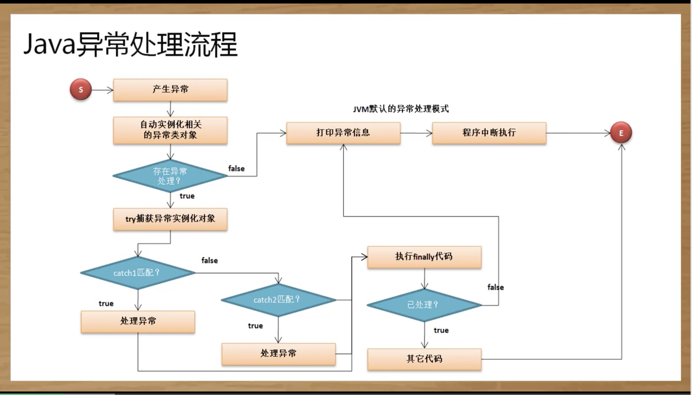

# 异常的捕获与处理

异常指的是导致程序中断执行的一种指令流


## 认识异常对程序的影响

``` java
public class JavaDemo {
  public static void main(String args[]) {
    System.out.println("【1】******程序执行开始");
    System.out.println("【2】******数字计算" + ( 10 / 0 ));
    System.out.println("【3】******程序执行完毕");
  }
}
// 执行结果： ArithmeticException
// 【1】******程序执行开始
// Exception in thread "main" java.lang.ArithmeticException: / by zero
// 	at JavaDemo.main(JavaDemo.java:4)
```

## 处理异常

异常处理可以使用： try catch finally这几个关键字来完成

``` java
try {
  // 可能出现异常的语句
} [catch (异常类型 异常对象) {
  // 异常处理
}catch (异常类型 异常对象) {
  // 异常处理
}catch (异常类型 异常对象) {
  // 异常处理
}...] [finally {
  // 不管异常是否处理都要执行
}]

// 在此结构中可以使用的组合为： try...catch,  try...catch...finally,  try...finally
```

如果要想获得非常完整的异常信息，则可以使用异常类中提供的printStackTrace()方法

``` java
public class JavaDemo {
  public static void main(String args[]) {
    System.out.println("【1】******程序执行开始");
    try{
      System.out.println("【2】******数字计算" + ( 10 / 0 ));
    }catch(ArithmeticException e) {
      e.printStackTrace();
    }
    System.out.println("【3】******程序执行完毕");
  }
}

// result:

// 【1】******程序执行开始
// java.lang.ArithmeticException: / by zero
// 	at JavaDemo.main(JavaDemo.java:5)
// 【3】******程序执行完毕
```

finally语句不管是否出现异常都会执行

``` java
public class JavaDemo {
  public static void main(String args[]) {
    System.out.println("【1】******程序执行开始");
    try{
      System.out.println("【2】******数字计算" + ( 10 / 0 ));
    }catch(ArithmeticException e) {
      e.printStackTrace();
    }finally {
      System.out.println("【F】不管是否出现异常都执行");
    }
    System.out.println("【3】******程序执行完毕");
  }
}
```

## 处理多个异常

``` java
public class JavaDemo {
  public static void main(String args[]) {
    System.out.println("【1】******程序执行开始");
    try{
      int x = Integer.parseInt(args[0]);
      int y = Integer.parseInt(args[1]);
      System.out.println("【2】******数字计算" + ( x / y ));
    }catch(ArithmeticException e) {
      e.printStackTrace();
    }catch(NumberFormatException e) {
      e.printStackTrace();
    }catch(ArrayIndexOutOfBoundsException e) {
      e.printStackTrace();
    }finally {
      System.out.println("【F】不管是否出现异常都执行");
    }
    System.out.println("【3】******程序执行完毕");
  }
}
```

## 异常处理流程



## throws关键字


## throw关键字


## 异常处理模型


## RuntimeException


## 自定义异常类


## assert断言

